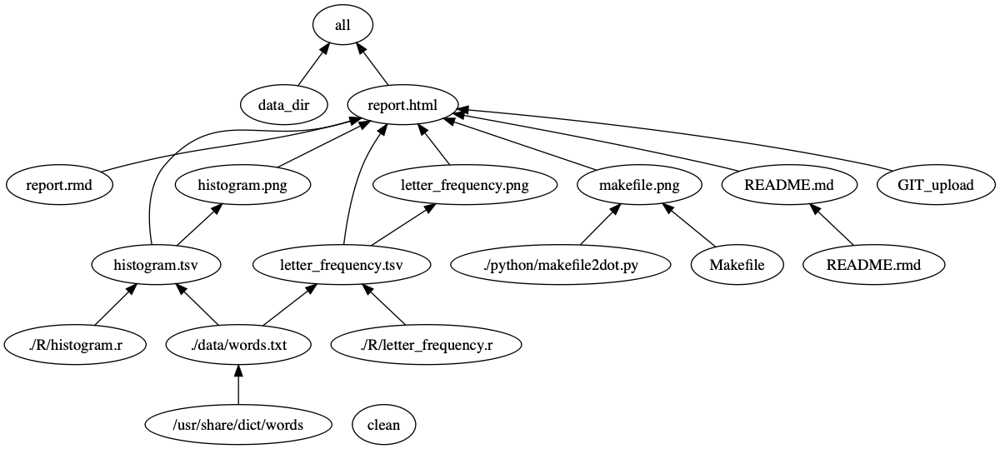

# STAT 545A Homework 09 Repo owned by Ziqiang Tang

## Overview

This assignment is to modify the make activity pipeline we made in class. You can go to **[report.html](https://raw.githack.com/STAT545-UBC-students/hw09-ziqiangt/master/report.html)**. The whole work is build by **[Makefile](https://github.com/STAT545-UBC-students/hw08-ziqiangt/tree/master/bcl/Makefile)**.

**My repository is structured as follows:**

| Documents | Description                        |
|-----------|------------------------------------|
| [Makefile](https://github.com/STAT545-UBC-students/hw08-ziqiangt/tree/master/bcl/Makefile)  | the Makefile used to build the whold project  |
| [README.md](https://github.com/STAT545-UBC-students/hw09-ziqiangt/blob/master/README.md)   | the file you are currenly looking   |
| [README.rmd](https://github.com/STAT545-UBC-students/hw09-ziqiangt/blob/master/README.Rmd) | the README R-markdown file for homework 9   |
| [report.md](https://github.com/STAT545-UBC-students/hw09-ziqiangt/blob/master/report.md)   | the markdown file for homework 9   |
| [report.rmd](https://github.com/STAT545-UBC-students/hw09-ziqiangt/blob/master/report.Rmd) | the R-markdown file for homework 9   |
| [report.html](https://github.com/STAT545-UBC-students/hw09-ziqiangt/blob/master/report.html) | the R-markdown file for homework 9   |
| [R](https://github.com/STAT545-UBC-students/hw08-ziqiangt/blob/master/bcl/R/)  | the R code used in this assignment |
| [python](https://github.com/STAT545-UBC-students/hw08-ziqiangt/tree/master/python)  |  the R code used in this assignment  |
| [results](https://github.com/STAT545-UBC-students/hw08-ziqiangt/tree/master/bcl/results)  | the .tsv data generated from the R code  |
| [image](https://github.com/STAT545-UBC-students/hw08-ziqiangt/tree/master/bcl/image)  | the .tsv data generated from the R code  |
| [data](https://github.com/STAT545-UBC-students/hw08-ziqiangt/tree/master/bcl/data)  | the input words.txt file  |
|Other | Other files such a .Rproj and .gitignore|

## Makefile structure

**This struture is generated with the help of [lindenbe's Python scripts](https://github.com/vak/makefile2dot). You may need to use these two codes to install Graphviz:

```
ruby -e "$(curl -fsSL https://raw.githubusercontent.com/Homebrew/install/master/install)"
brew install graphviz
```

The makefile structure is shown as below:**




## References
- [Automatic Variables](https://www.gnu.org/software/make/manual/html_node/Automatic-Variables.html)


## Here is my previous homework if you are interested
- You can click to go to my homework solutions
	+ homework01 
		* [homework01 solution](https://github.com/STAT545-UBC-students/hw01-ziqiangt)
	+ homework02
		* [homework02 solution](https://github.com/STAT545-UBC-students/hw02-ziqiangt)
	+ homework03
		* [homework03 solution](https://github.com/STAT545-UBC-students/hw03-ziqiangt)
	+ homework04
		* [homework04 solution](https://github.com/STAT545-UBC-students/hw04-ziqiangt)
	+ homework05
		* [homework05 solution](https://github.com/STAT545-UBC-students/hw05-ziqiangt)
	+ homework06
		* [homework06 solution](https://github.com/STAT545-UBC-students/hw06-ziqiangt)
	+ homework07
		* [homework07 solution](https://github.com/STAT545-UBC-students/hw07-ziqiangt)
	+ homework08
		* [homework08 solution](https://github.com/STAT545-UBC-students/hw08-ziqiangt)

## It's would be very kind if you could give me some **comments**.
 **[homework09 Comments](https://github.com/STAT545-UBC-students/hw09-ziqiangt/issues)**